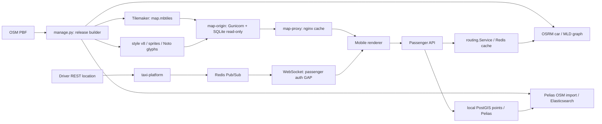
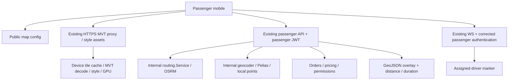

# Mobile GIS contract: taxi-platform → taxi-passenger

Дата исследования: **16.09.2026**. Статус: **architecture analysis; реализации нет**.

## 1. Executive summary

Источник CURRENT — рабочее дерево `Q:\taxi-platform`, HEAD
`8e0b180dec06f504d36aceeef5b0f0179310e8e3`, и существующий изменённый
`GIS_BACKEND_AUDIT.md`. В заголовке аудита указан более ранний `5a4e13f`;
поэтому утверждения сверены непосредственно с кодом. Backend использован
**только для чтения**. Этот документ хранится в `taxi-passenger` по указанию
пользователя. Ссылки [B01]–[B37] ведут в прочитанный backend; функции и разделы
указаны в реестре источников в конце.

Основные выводы:

- Существуют собственные gzip MVT/MBTiles, origin, nginx cache, дневной стиль
  v8, sprites и локальные glyphs. Перепроектирование GIS stack не требуется. [B02]–[B08]
- Реальный tile path: `/releases/{version}/tiles/{z}/{x}/{y}.pbf`.
  Реальные source layers: `road`, `building`, `housenumber`, `place`, `poi`,
  `water`, `landuse`. Имена `roads`/`buildings` не являются MVT source layers. [B03]–[B05]
- **Passenger GIS equivalents уже есть**: `POST /api/v1/passenger/map/routes`
  и `GET /api/v1/passenger/address/reverse`. Они используют passenger JWT.
  Общие `/map/routes` и `/geocoder/reverse` мобильному пассажиру не нужны. [B09], [B11]–[B14]
- Route API возвращает GeoJSON `LineString`; estimate использует ту же routing
  service, но геометрию не возвращает. Для первого клиента подходят два
  существующих запроса: маршрут для линии, estimate для цены. [B15]–[B19]
- **Блокирующий GAP — passenger WebSocket authentication**: publisher создаёт
  нужные события, но подключённый к `/ws` auth service разбирает общий
  payload claim `typ=access`, а passenger JWT содержит `token_type=passenger`,
  `token_use=access` и не содержит payload claim `typ`.
  Такой passenger JWT не проходит текущую проверку. Это вывод из цепочки
  исходников, а не проведённый тест с пользовательским токеном. [B10], [B14], [B25]–[B28]
- Код и работающий backend нельзя считать одной версией: read-only запрос
  `GET http://192.168.0.50:8080/api/v1/public/map/config` вернул **404**.
  В полученном с этого сервера `/swagger/doc.json` отсутствуют новые map/reverse
  endpoints, имеющиеся в исходниках Q:. Причину deployment mismatch этот
  анализ не устанавливает. В текущем коде незаполненная map config должна
  давать **503**, поэтому наблюдаемый 404 — отдельное свидетельство расхождения. [B09], [B12]

**Граница:** backend готовит данные, маршруты, метрики, цены и события;
mobile кеширует и рисует tiles, линии и маркеры. OSRM/Pelias/ES/Redis/PostgreSQL/
libpostal остаются внутренними деталями.

Ограничения доказательств: Docker, effective environment, volumes и реальные
MBTiles региона не исследовались; секретные `.env` не читались. GIS jobs,
активация release, тесты backend и изменения инфраструктуры не выполнялись.
Наличие кода не доказывает production readiness. Monaco-проверка — исторический
отчёт, не результат повторного запуска и не проверка Android 9. [B01], [B35]

## 2. Current GIS architecture



`Pipeline.tiles` запускает Tilemaker и записывает
`{root}/releases/{version}/map.mbtiles`, default root `/srv/taxi-maps`.
Один `region.osm.pbf` используется для tiles, OSRM graph и Pelias import.
`generate_compose` создаёт release-specific OSRM, Elasticsearch, Pelias и
libpostal. OSRM запускается с `--algorithm mld`; подготовка — extract с
`/opt/car.lua`, partition, customize. [B02], [B08]

`map-origin` читает MBTiles через SQLite `mode=ro&immutable=1`, assets — из
`release/public/`. Gunicorn слушает 8000, работает от UID 65534, имеет 2 workers
и 4 threads. Compose монтирует data root read-only. `map-proxy` — отдельный
nginx; он не маршрутизирует business API. [B05], [B06], [B08]

`docker-compose.yml`/`docker-compose.prod.yml` также содержат фиксированный
Pelias deployment. `docker-compose.deploy.yml` сам по себе GIS stack не
разворачивает. Какой dataset используется работающим backend, нужно сверять
с effective deployment; смешивать эти варианты в один подтверждённый runtime
нельзя. [B02], [B36]

## 3. Current vector tile contract

### Bootstrap и URL

`GET /api/v1/public/map/config` зарегистрирован как public. Успех обёрнут в
`{"data": ..., "meta":{"request_id":"..."}}`. Поля data:
`style_url`, `styles:[{id:"day",url}]`, `bounds`, `min_zoom`, `max_zoom`,
`data_version`, `updated_at`, `attribution`, `search_available`,
`routing_available`. `bounds` — `[west,south,east,north]`, включая пересечение
антимеридиана при `west > east`. Flags вычисляются из настроек и не являются
live health/SLA. [B09], [B11], [B12], [B34]

Реальные URL строятся из `maps.public_url` и `maps.data_version`:

```text
{maps.public_url}/releases/{data_version}/style.json
{maps.public_url}/releases/{data_version}/tiles/{z}/{x}/{y}.pbf
```

`maps.public_url` должен быть HTTPS URL без credentials, query и fragment;
release version соответствует `[A-Za-z0-9_-]+`. `https://maps.example.com` из
example config — шаблон, не установленный адрес сервиса. Bare `/tiles/...`
origin не обслуживает. Внутренний proxy upstream — `http://map-origin:8000`.
Host binding proxy по умолчанию `127.0.0.1:8090`; production HTTPS hostname
этим исследованием не подтверждён. [B05], [B06], [B08], [B12]

| Свойство | CURRENT | Основание |
| --- | --- | --- |
| Методы | Origin GET/HEAD; proxy также OPTIONS | [B05], [B06] |
| Payload | MVT protobuf, `.pbf`, внутри SQLite MBTiles | [B03]–[B05] |
| Content-Type tiles | `application/vnd.mapbox-vector-tile` | [B05] |
| Compression | Tilemaker `compress:gzip`; origin распознаёт magic `1f8b` и ставит `Content-Encoding:gzip` | [B03], [B05] |
| HTTP addressing | XYZ; SQLite row вычисляется как `2**z - 1 - y` (TMS storage) | [B05] |
| Zoom данных | 0–14, basezoom 14; не гарантируется непустой tile на каждом zoom | [B03], [B05] |
| Zoom отображения | config default 0–22, style source maxzoom 14: выше нужен overzoom существующих tiles | [B07], [B12] |
| Feature IDs | `include_ids:false`; не рассчитывать на стабильные OSM IDs в tile | [B03] |
| Publication | Обязателен `validated.json`; release без marker не публикуется | [B05] |

`scheme` явно не задан в style source; фактический XYZ подтверждается
преобразованием в origin. MVT extent, полный metadata table и фактические
геометрии конкретного регионального MBTiles здесь не извлекались; не следует
подменять их предположением о конкретном extent или полноте данных.

### HTTP cache/status semantics

| Ответ origin | Заголовки / смысл |
| --- | --- |
| 200 asset/tile | SHA-256 quoted ETag; `Cache-Control: public,max-age=31536000,immutable`; Content-Type/Length |
| 304 | При точном совпадении `If-None-Match`; тело отсутствует |
| 204 missing tile | `Cache-Control: public,max-age=86400`; пустая область, не protobuf для декодирования |
| 404 | Неизвестный/невалидированный release, неверные tile coordinates или отсутствующий asset: `no-store`; для URL вне release pattern origin возвращает простой 404 без этой cache directive |
| 503 | SQLite/I/O failure: `no-store` |

Last-Modified и обработка If-Modified-Since не реализованы. `HEAD` всё равно
читает payload и вычисляет hash. Геоданные immutable по URL, но это не обещание
вечного наличия release: `prune` может удалить старую версию. [B05], [B02]

## 4. MVT layers / properties

Ниже **schema генератора**, выведенная из `tilemaker.json` и `process.lua`,
а не выдуманные OpenMapTiles layer names и не полная инвентаризация production
MBTiles. String attributes добавляются явно через Lua. `name` опционален:
предпочитается `name:ru`, затем `name`, иначе свойства нет. [B03], [B04]

| Реальный source-layer | Геометрия по Lua | Свойства | Отбор и zoom | Mobile usage |
| --- | --- | --- | --- | --- |
| `road` | LineString/линейные features из ways | `class` = OSM `highway`; optional `name` | z5–14; motorway/trunk/primary от z5, остальные от z11 | Дороги, hierarchy по class, названия вдоль линии |
| `building` | Polygon из closed ways | Пользовательские attributes не добавляются | building не пустой и не `no`; z13–14 | Контуры/заливка; высота и этажность отсутствуют |
| `housenumber` | Point узла либо centroid closed way | `number` = `addr:housenumber` | z14 | Номера домов; полный адрес/улица не передаются |
| `place` | Point | `class` = OSM place; optional `name` | schema z3–14, Lua city от z5, остальные от z10 | Названия населённых пунктов |
| `poi` | Point узла либо centroid closed way | Только optional `name` | amenity/shop/tourism не пустой; z13–14 | Generic POI; категория не экспортируется |
| `water` | Polygon из closed ways | Attributes не добавляются | natural=water либо waterway=riverbank; z6–14 | Водные полигоны |
| `landuse` | Polygon из closed ways | Attributes не добавляются | landuse не пустой либо leisure=park; z8–14 | Общая заливка землепользования |

Типы указаны на уровне point/line/polygon, задаваемом pipeline. Разбиение,
clipping и multipart представление конкретных MVT features не проверены.
Нет собственного relation callback, отдельной обработки открытых waterways/
coastline, специальных railway/boundary/entrance layers. Не обещать покрытие
этих объектов без проверки Tilemaker на реальном dataset. [B04]

`Pipeline.validate` проверяет один контрольный tile и по умолчанию непустые
`road`/`building`; `vector_tile.py` считает features по layer name, но не
проверяет properties/geometry schema. Monaco-отчёт приводит `road=3748`,
`building=1658`, `housenumber=150`, `poi=714` на одном z14 tile. Это не
доказательство наличия всех семи слоёв в каждом tile/регионе. [B02], [B35], [B37]

## 5. Current style / assets

Стиль **существует**, генерируется `assets.write_assets`: MapLibre-compatible
style JSON `version:8`, `name:"Taxi OSM day"`, vector source `osm`.
Стилизация отделена от MVT, но lifecycle привязан к тому же release version.
API публикует только `day`; night theme и отдельной style revision нет. [B07], [B09]

| Asset | Реальный путь относительно `/releases/{version}/` | Содержание |
| --- | --- | --- |
| Style | `style.json` | background, landuse/water/building fill, road line, labels |
| Sprite | `sprite.json`, `sprite.png`, `sprite@2x.json`, `sprite@2x.png` | Один project-owned круглый значок `poi`, pixelRatio 1/2 |
| Glyphs | `fonts/{fontstack}/{range}.pbf` | Font stack `Noto Sans Regular`; пробелы URL-encode |
| Attribution/licenses | `LICENSE.txt`, `fonts/OFL.txt` | OSM attribution, project style/icons, Noto font license |

Glyphs скачиваются при build из закреплённого архива с SHA-256 и размещаются
локально. Smoke validation проверяет в том числе `0-255.pbf` и `1024-1279.pbf`.
`audit_style` запрещает imports и внешние tile/glyph/sprite URL; runtime-клиент
использует свой map origin. Glyph MIME — `application/x-protobuf`, sprite —
`image/png`, style/sprite JSON — `application/json`. [B02], [B05], [B07]

CURRENT потребности и ограничения свойств:

- Roads: достаточно geometry + `class` + `name` для простой hierarchy/labels;
  текущий стиль рисует дороги одинаково и `class` для paint не использует.
- Buildings/water: geometry достаточна для существующей заливки; height,
  levels, water type отсутствуют.
- Landuse: geometry есть, category отсутствует; разные классы landuse
  различить текущими свойствами нельзя.
- Labels: используются `name`; road от display z12, place z4, POI z15.
  Фактический показ также ограничен наличием feature в исходном tile.
- House numbers: `number`, display z16 через overzoom z14.
- POI: generic icon + optional name; категории для аэропортов, парковок,
  вокзалов и т. п. не передаются. Многоязычный выбор клиентом отсутствует:
  pipeline уже выбирает одно имя с приоритетом русского. [B03], [B04], [B07]

TARGET первого mobile клиента — использовать существующий style contract.
Новый визуальный дизайн и генерация style в рамках анализа не выполняются.

## 6. Current routing contract

### Passenger REST → application → OSRM

```text
POST /api/v1/passenger/map/routes + passenger access JWT
  → MapHandler.Route → maps.Service.Route
  → routing.Service → Redis CachedService → OSRM Client.Route
  → validated routing.Route → {data, meta}
```

Существующий general equivalent `POST /api/v1/map/routes` имеет тот же DTO,
но другой JWT boundary. Обе регистрации используют один handler/service.
Маршрут строится по двум переданным точкам: endpoint сам не раскрывает
заказ/водителя и не выдаёт право читать их координаты. [B09]–[B11], [B15], [B16]

Request (иллюстрация структуры, координаты не являются результатом live route):

```json
{
  "points": [
    {"latitude": 58.010455, "longitude": 56.229443},
    {"latitude": 58.020000, "longitude": 56.250000}
  ]
}
```

| Response `data` | Формат / единицы |
| --- | --- |
| `geometry` | GeoJSON geometry object `{type:"LineString",coordinates:[[lon,lat],...]}`; не FeatureCollection и не encoded polyline |
| `distance_meters` | int64, метры, `math.Round` OSRM distance |
| `duration_seconds` | int64, секунды, `math.Round` OSRM duration |
| `original_points` | Два исходных объекта `{latitude,longitude}` |
| `snapped_points` | Два объекта `{latitude,longitude}` после привязки к графу |
| `source` | `osrm` |
| `data_version` | Версия routing dataset из config |
| `calculated_at` | UTC timestamp; на cache hit остаётся временем первоначального расчёта |

Координаты API — числа в градусах. OSRM URL строится через Go `%f`, то есть
в запрос передаются шесть знаков после запятой. GeoJSON response сохраняет
числа, разобранные в float64; фиксированная precision ответа не обещана.
Это **не polyline6**. Original points сохраняют исходные значения, а не
округлённую строку OSRM URL. [B15], [B16]

OSRM request:

```text
GET {internal_osrm}/route/v1/driving/{lon},{lat};{lon},{lat}
    ?overview=full&geometries=geojson&steps=false&radiuses={r};{r}
```

Profile — `driving`, построенный `/opt/car.lua`, graph MLD. Default snap radius
500 m; default HTTP timeout 3 s; response limit 2 MiB; одна HTTP-попытка,
bounded retry в адаптере отсутствует. Проверяются finite/nonnegative metrics,
ровно два waypoints, валидный LineString и координаты, region bounds,
distance snapping. Live traffic источник не настроен. [B02], [B12], [B16]

| Ситуация | CURRENT HTTP |
| --- | --- |
| Неверный JSON/количество точек/координаты | 400 `VALIDATION_ERROR` |
| Не тот/отсутствующий токен | 401; неактивный passenger — 403 |
| NoRoute, NoSegment, outside coverage/snap radius | 422 `VALIDATION_ERROR` |
| Unconfigured/unreachable/timeout/malformed upstream | 503 `INTERNAL_ERROR` / `Map service unavailable` |

Успешные маршруты кешируются в Redis, default TTL 5 min. Ключ включает точные
исходные points и namespace из URL, data version, profile, geometry options,
snap radius и bounds. Ошибки не кешируются; ошибка Redis ведёт к upstream
с логированием. Этот TTL — серверный cache, не HTTP cache policy mobile. [B09], [B10], [B12], [B17]

## 7. Current estimate flow: route ≠ price

Source of truth пассажирской оценки — **`POST /api/v1/passenger/orders/estimate`**.
Request содержит `pickup_location`, `destination_location`, optional `city_id`,
`car_class_id` либо legacy `tariff_id` (сервис разрешает их как car class).
Endpoint защищён passenger middleware. [B18], [B19], [B33]

Фактический call path:

1. Проверить active passenger, car class и coordinates; определить city.
2. `buildTaxiParkEstimate` вызывает общий `routing.Service.Route`.
3. `resolveTaxiParkTariffs` ищет подходящие тарифы парков: сначала 5 km,
   затем 10 km; передаёт freshness cutoff 2 min для availability query.
4. `domain.CalculateTripPrice` применяет fixed/distance/time/distance_time,
   base/minimum price и серверное округление.
5. Вернуть среднее, минимум/максимум по найденным тарифам, availability,
   road metrics, source/version. [B18], [B20]

Distance в верхнем DTO — `distance_km = meters / 1000`; `duration_min` округлена
вверх из секунд. `pricing.route_distance_meters` и
`pricing.route_duration_seconds` сохраняют точные целочисленные road metrics.
`pricing.estimated_price.amount` — minor units; legacy верхний `price`
вычисляется целочисленно как amount/100. Пользоваться structured `pricing`
и `price_available`, не интерпретировать ноль как бесплатную поездку. [B18]–[B20]

При routing failure сервис возвращает успешный estimate DTO с
`pricing.price_available=false`, `estimated_price_source:"unavailable"`,
`unavailable_reason` (`route_not_found`, `routing_invalid_response`,
`routing_unavailable`). Нет тарифов — `no_available_park_tariffs`.
Остаточные straight-line helpers присутствуют, но этот call path их не
вызывает. Не считать их разрешённым fallback. [B18]

**Geometry в estimate/order DTO нет**, хотя `routing.Route` её содержит.
Она доступна пассажиру отдельным существующим route endpoint, поэтому GAP —
не отсутствие passenger geometry API, а отсутствие единого snapshot ID,
связывающего два запроса. При смене dataset между запросами версии могут
различаться. Shared route cache уменьшает повторный расчёт, но не даёт
транзакционную согласованность. `duration_seconds` маршрута — длительность
поездки, не ETA подачи; `eta_seconds` order DTO — отдельное поле. [B15], [B17]–[B19]

`GET /driver/orders/{id}/route` возвращает сохранённые GPS points поездки;
это не OSRM route API и не passenger endpoint. [B19], [B32]

## 8. Current geocoding contract

### Passenger address search

`GET /api/v1/passenger/address/search?q=...` с passenger access JWT.
Параметры: `q` (непустой после нормализации), optional UUID `city_id`,
пара `lat`/`lon` для focus, integer `limit`. Handler default 10; service
заменяет limit ≤ 0 на default. Явной верхней границы в passenger handler/
service нет; фактические upstream ограничения нельзя выдавать за API guarantee.
Отдельного autocomplete endpoint в исследованной цепочке нет: используется
search → Pelias `/v1/search`. [B21]–[B24]

Ответ — `{data:{results:[...]},meta}`. У элемента:
`id`, optional `local_point_id`, `provider`, `name`, `address`, optional
`city_id`, `coordinates:{latitude,longitude}`, `confidence`, optional
`trust_level`, `external_place_id`. Passenger mapper не передаёт `expires_at`
из внутренней модели. [B22]

Flow по коду:

1. Passenger service строит focus; если city не задан, пытается определить
   его по координатам. При пустом результате и inferred city повторяет запрос
   без этого city ID (общий service ещё может определить actor city).
2. Hybrid service нормализует query, дополняет city/focus из actor/city;
   сначала запрашивает local PostGIS points. Непустой local result возвращается
   сразу, без объединения с Pelias.
3. Внешнему по отношению к приложению, но self-hosted Pelias передаётся query
   с city prefix, если его ещё нет, `size`, `focus.point.lat/lon`.
4. При best confidence ≥ 0.75 вернуть Pelias. Иначе попытаться получить
   DaData, затем Yandex (если разрешены), затем низкоуверенный Pelias.
   При пустом результате возможен повтор без city prefix. [B21], [B23], [B24]

Hosted fallbacks уже существуют в коде; defaults выключены. Это описание
CURRENT, не предложение их включить. `searchExternalProvider` проверяет
provider cache **до** enabled flag: отключение upstream не обязательно
исключает ранее кешированные hosted results. Strict self-hosted политика
требует отдельной проверки этого поведения и effective config. Pelias search
вызывается напрямую; наличие `pelias_cache_ttl_days` не означает, что этот
путь кеширует все его ответы. [B12], [B23]

Pelias mapping: GeoJSON `coordinates[0]` → longitude, `[1]` → latitude;
`id` fallback `gid`, name fallback label, address label fallback name;
confidence fallback match_confidence при нулевом confidence. Невалидные
координаты/features пропускаются. Явных `lang`/locale/Accept-Language
параметров клиент не передаёт. Timeout в wiring 3 s, JSON reading ограничено
2 MiB, retry отсутствует. [B10], [B24]

**Error GAP:** Pelias exception логируется; итоговый unavailable flag основан
на ошибках DaData/Yandex. При выключенных fallbacks outage Pelias может
превратиться в успешный пустой results. Нельзя трактовать `[]` как доказанное
отсутствие адреса. Cache hosted providers находится в backend repository;
это не основание давать mobile кеш на 30/3650 дней. [B23]

Некорректный формат city/focus/limit отклоняется handler с 400. Однако
`geodomain.ErrInvalidQuery` (например, пустой q) и `ErrInvalidCoordinates`
из application service не имеют отдельных ветвей в общем `failByError`:
текущий путь возвращает 500. Это отдельный error-mapping GAP; документированное
ожидание 400 нельзя считать фактическим поведением всех invalid-input случаев.
[B21], [B22], [B31]

Pelias читает Elasticsearch index `pelias`, release config подключает
libpostal и импортирует OSM PBF с `importVenues:true`,
`adminLookup.enabled:false`. Отдельный импорт OpenAddresses/WOF/interpolation
в этом pipeline не задан. Local points не исчезают: они обслуживаются
первой ступенью hybrid search. [B02], [B23]

### Reverse

`GET /api/v1/passenger/address/reverse?lat=...&lon=...` — passenger JWT;
`GET /api/v1/geocoder/reverse` — general JWT. Обе регистрации используют
`maps.Service.Reverse` → Pelias `/v1/reverse?point.lat=...&point.lon=...&size=1`.
Это отдельный прямой Pelias path, без local-first/hosted fallback цепочки. [B09], [B24]

Data DTO: `point:{latitude,longitude}`, `found`, `address`, optional
`address_location:{latitude,longitude}`, `source:"pelias"`.
`point` сохраняет выбранную координату; найденный адрес может относиться к
другой точке. **Не заменять pickup найденным address_location автоматически.**
Нет результатов → HTTP 200, found=false; invalid input → 400; provider error
→ 503. Пустой Pelias baseURL возвращает пустой результат на уровне адаптера,
что также требует учитывать availability config. [B09], [B24]

## 9. Current authentication boundaries

| Surface | Проверка по цепочке | Правило mobile |
| --- | --- | --- |
| `/public/map/config` | Исключён из общего JWT middleware | Public bootstrap, не internal URL |
| Map tiles/style/fonts/sprites | Отдельный origin/proxy без JWT | Загружать с map host |
| `/passenger/map/routes`, `/passenger/address/reverse`, `/passenger/address/search`, `/passenger/orders/*` | Пропускаются общим middleware, затем проверяются passenger middleware | Только passenger access token |
| `/map/routes`, `/geocoder/reverse`, `/geocoder/search` | Общий `AuthenticateAccessTokenWithMatchers` | Не использовать passenger-клиентом |
| `/ws` | Общий middleware пропускает, handler отдельно вызывает `mobileAuthService.AuthenticateWebSocket` | CURRENT passenger token rejected; GAP ниже |
| OSRM/Pelias/ES/libpostal/Redis/PostgreSQL | Внутренние сервисы, не mobile contract | Не выдавать endpoints/credentials клиенту |

Исключение из **общего** middleware не означает public passenger API.
Passenger middleware проверяет подпись/issuer/expiry, `token_type=passenger`,
`token_use=access`, role, passenger ID, lookup в repository и active flag.
General parser проверяет payload claim `typ=access`; у passenger payload
такого поля нет. Header `typ:JWT` есть у обоих и не определяет категорию actor.
Общие secrets в wiring не делают
форматы токенов взаимозаменяемыми. Существующий
`TestMapRoutesKeepPassengerAndUserTokensSeparate` описывает отказ чужому
типу JWT; тест прочитан, но не запускался. [B10]–[B14]

**Минимальное решение REST:** использовать уже существующие passenger GIS
equivalents после подтверждения deployment. Не менять general middleware
и не выдавать пассажиру общий/internal token.

**Минимальное предложение WS:** на существующем `/ws` добавить application
authentication, явно различающий допустимые категории credentials и
проверяющий их соответствующим полноценным parser + actor lookup/active
policy. Не доверять неподписанным claims как авторизации и не принимать
refresh token. Для passenger сохранить passenger ID как адресата Redis
channel, для user — существующую user identity. Протокол событий оставить.
Это TARGET, в этом этапе не реализовано. [B10], [B14], [B25]–[B28]

## 10. Current tile authentication / cache и варианты TARGET

CURRENT: tiles public на уровне origin/proxy; нет JWT, token validation,
signed URL, `auth_request`, `limit_req` или `limit_conn`. Read-only origin
не имеет management HTTP API и host-port mapping. Он доступен участникам
Docker maps network; external network не равнозначна `internal:true`.
Proxy опубликован только на host loopback, HTTPS edge показан sample config.
Прямую публичную недоступность origin без проверки deployment/firewall
гарантировать нельзя. [B05], [B06], [B08]

nginx: cache zone 20 MiB, disk max 2 GiB, inactive 30 days; cache key **`$uri`**,
без query; 200 TTL 365 days, 204 TTL 1 day, cache lock/revalidate; upstream
Accept-Encoding очищается, готовый gzip tile возвращает origin. Для JSON/
protobuf/MVT включён nginx gzip. CORS настроен на один `${MAP_CORS_ORIGIN}`,
разрешает GET/HEAD/OPTIONS и `If-None-Match`, exposes ETag/Cache-Control.
CORS не является механизмом доступа для native apps. [B05], [B06]

| Вариант TARGET, без реализации | Cache/latency | Security trade-off |
| --- | --- | --- |
| **Предпочтительно сначала:** public immutable tiles через существующий HTTPS edge + rate/connection/egress limits | Сохраняет общий cache и минимум работы на запрос | Tiles можно скачивать; закрыть origin/internal ports и наблюдать abuse |
| Короткоживущий map-scoped signed access, проверяемый edge до cache hit | Можно сохранить общий asset cache после проверки; локальная криптопроверка | Нужно согласовать token expiry/refresh и renderer request hooks; current code этого не делает |
| Map-scoped bearer с дешёвой локальной проверкой edge | Без DB lookup на каждый tile; общий cache только для одинакового контента | Больше mobile/native integration; не использовать полный business passenger auth lookup |

С текущим `$uri` нельзя просто добавить `?token=...` и считать tiles защищёнными:
query не входит в cache key, а проверка токена отсутствует. В signed варианте
авторизация обязана выполняться и для cache HIT, до выдачи данных. Если
контент когда-либо станет tenant-specific, cache key должен различать
варианты. Это предложения, не существующая security model. [B06]

## 11. Current WebSocket driver-location contract

Endpoint `/api/v1/ws`, token из Authorization Bearer либо query fallback.
Существующий event name — **`driver.location_updated`**, не `type:driver.location`.
Структура по `Message` и `PassengerDriverLocationPayload` (значения ниже
иллюстративны, не live capture): [B25], [B26]

```json
{
  "event": "driver.location_updated",
  "request_id": "11111111-1111-1111-1111-111111111111",
  "occurred_at": "2026-09-16T00:00:00Z",
  "payload": {
    "order_id": "22222222-2222-2222-2222-222222222222",
    "driver_id": "33333333-3333-3333-3333-333333333333",
    "status": "driver_arriving",
    "location": {"latitude": 58.010455, "longitude": 56.229443},
    "heading": 180,
    "speed_mps": 7.5,
    "accuracy_meters": 8,
    "recorded_at": "2026-09-16T00:00:00Z"
  }
}
```

Heading optional integer degrees 0–359 в request binding; speed — m/s,
accuracy — meters. `occurred_at` создаётся gateway при публикации;
`recorded_at` текущий mobile location service ставит по серверному UTC
времени при приёме update, а не гарантированно по исходным часам GPS. [B19], [B25], [B29]

Driver REST update сохраняет координаты/track, определяет текущий заказ
водителя и публикует событие конкретному `order.PassengerID`. Redis channel
`ws:user:{id}`; от клиента не требуется выбирать чужие topics. Handler
читает входящие frames, но не реализует JSON subscription protocol из
Flutter reference. Dispatcher payload для того же event содержит другие
поля; passenger должен использовать passenger DTO. Base tiles не меняются. [B26], [B28], [B29]

У single location update есть Redis throttle 2 s, но это **не гарантированный
интервал доставки WS**. Batch path подавляет throttled updates на уровне
location service и публикует последнюю точку batch; поток не имеет жёсткого
SLA/sequence. [B29], [B30]

После успешного handshake сервер сразу отправляет `sync.required` с
`payload:{user_id,role,reason:"reconnect"}` — в том числе при первом соединении.
Ping 45 s, pong/read deadline 60 s, write timeout 10 s, read limit 4096 bytes.
Redis Pub/Sub не хранит replay/cursor. Подписка создаётся после bootstrap,
поэтому bootstrap + REST не даёт атомарного snapshot событиям. [B26], [B28]

TARGET mobile: после подключения/resume инвалидировать текущий заказ и
перечитать `GET /api/v1/passenger/orders/current`; проверять order_id/driver_id
события относительно актуального заказа; события заказа синхронизировать
с REST, location применять только к overlay marker. Интерполяция и stale
marker UX — client presentation. Это поведение будущего клиента, не уже
реализованный renderer. [B26], [B33]

Дополнительные GAP:

- Passenger token сейчас отклоняется WS authentication — см. раздел 9.
- `AssignedDriverDTO` и `PassengerOrderResponse` не содержат current driver
  coordinates/recorded_at: REST восстанавливает order identity/status,
  но не полный location snapshot. После reconnect marker ждёт следующего
  события; надёжный начальный snapshot требует отдельного минимального
  согласования. [B19], [B33]
- Нет sequence/ack/replay контракта; `request_id` не является monotonic
  sequence. Предложение первого клиента — отбрасывать явно более старые
  timestamps и показывать stale state, не обещать восстановление истории.

## 12. Data classification

CURRENT HTTP cache policy business APIs специально не задаётся изученными
handlers/response helper; Redis/Postgres cache ниже не является публичным
HTTP cache. Client policies в последнем столбце — **TARGET**. [B34]

| DATA | SOURCE | TRANSPORT | CACHE POLICY — CURRENT | UPDATE FREQUENCY — CURRENT | MOBILE USAGE / TARGET |
| --- | --- | --- | --- | --- | --- |
| Base map | Tilemaker MBTiles | Public HTTP MVT gzip | Immutable 1 year; missing tile 1 day; nginx disk cache | Новый release; monthly timer — шаблон, установка не доказана | Bounded tile cache + GPU renderer; без business data [B02]–[B08] |
| Map style | assets.py + pinned Noto glyphs | HTTP JSON/PNG/PBF | Тот же immutable release | Вместе с release | Versioned cache, существующий day style [B07] |
| Map config | maps.Service settings | Public REST | Явный cache TTL не задан | Активация/settings | Revalidate на старте/resume и missing release; не вечный cache [B09], [B34] |
| Route geometry | OSRM car graph | Passenger REST GeoJSON | Redis successful route 5 min default | По запросу/изменению точек | Cache по points/version, отдельная линия [B15]–[B17] |
| Distance | OSRM, округлённые meters | Route REST + estimate pricing | Route Redis cache; estimate не immutable | По запросу | Отображать metrics; не считать цену на устройстве [B16], [B18] |
| Duration | OSRM, seconds | Route REST + estimate minutes | Как route; не live traffic | По запросу | Длительность поездки, не ETA подачи [B16], [B19] |
| Address search | Local PostGIS → Pelias → optional hosted | Passenger REST results | Provider-specific backend cache; Pelias direct path | По запросу; dataset/local edits | Debounce/cancel устаревших запросов, короткий client cache [B21]–[B24] |
| Reverse geocoding | Pelias напрямую | Passenger REST | Отдельный cache не найден в цепочке | По выбранной точке | Address label отдельно от pickup coordinate [B09], [B24] |
| Order state | Passenger order service/repository | REST + WS | REST — authority; Pub/Sub без replay | Жизненный цикл заказа, reconnect | Server-state cache, REST resync [B25], [B26], [B33] |
| Driver location | Driver location service → Redis publisher | WS event, passenger auth GAP | Ephemeral realtime; REST location snapshot отсутствует | По updates; single update throttle 2 s, batch caveat | Overlay marker, stale handling; без обновления MVT [B28]–[B30] |
| Nearby cars | Внутренний поиск availability/tariffs | Passenger map feed не найден | Публичной cache policy нет | Внутренняя оценка/dispatch | Не рисовать вымышленные машины; отдельное требование при необходимости [B18], [B32], [B33] |

## 13. CURRENT → TARGET gaps

| Приоритет | Подтверждённый GAP | Минимальное направление, без реализации |
| --- | --- | --- |
| P0 | Source/deployed contract divergence: map config 404; live Swagger не содержит новых GIS routes | Сверить deployed image/commit/OpenAPI и effective release config до интеграции mobile |
| P0 | `/ws` не принимает passenger token в текущем wiring | Добавить explicit passenger authentication в существующую WS boundary; протокол не менять [B10], [B14], [B27] |
| P1 | Production map domain/release/coverage не доказаны; defaults пусты | Подтвердить реальный HTTPS map URL и региональный dataset; Monaco недостаточно [B12], [B35] |
| P1 | `backend_override` передаёт version/URLs, но не manifest bounds | Согласовать effective coverage bounds/zoom; избежать Russia bounds на другом release [B02], [B12] |
| P1 | REST current order не восстанавливает driver location snapshot | Согласовать минимальное snapshot-поле/доступ на существующей authorized boundary либо явно принять ожидание следующего события [B19] |
| P1 | Geometry и estimate два отдельных запроса без общего snapshot ID | На первом этапе одинаковые points и сверка доступных version fields; additive snapshot contract только при необходимости [B15]–[B19] |
| P1 | Pelias outage может выглядеть как no results | Отдельно определить unavailable/empty/invalid error semantics [B23], [B24] |
| P2 | Часть invalid search input становится HTTP 500 | Явно согласовать mapping domain errors → transport errors [B21], [B31] |
| P1 | Hosted cached results могут читаться до enabled checks | Подтвердить strict self-hosted policy, включая cache, не включать провайдеров [B23] |
| P2 | Tiles public; rate/abuse limits отсутствуют в map configs | Ограничения на существующем edge, закрытый origin, cache observability [B06], [B08] |
| P2 | Night/style revision отсутствуют, POI/landuse category и building height не экспортируются | Начать с существующего day style; расширять schema только по подтверждённой потребности [B03], [B04], [B07] |
| P2 | Release retention короче потенциального срока immutable client cache | Согласовать retention и повторный config fetch на 404; не перезаписывать опубликованный URL [B02], [B05] |
| P2 | Нет regional payload/feature budgets и native Android 9 verification | Отдельный будущий mobile/pilot этап, измерить dense tiles, glyphs, overzoom, memory [B35] |
| P2 | Нет явного max search limit / locale contract | Согласовать ограничения, language и debouncing при API/mobile этапе [B21]–[B24] |

**Не GAP:** отсутствие tileserver, дневного стиля, passenger route/reverse
endpoints или GeoJSON route geometry. Эти части уже существуют в исходниках.

## 14. Proposed mobile-facing target



Предлагаемый минимальный набор вызовов не добавляет endpoints:

| Назначение | Использовать существующий контракт |
| --- | --- |
| Map bootstrap | `GET /api/v1/public/map/config` |
| Tiles/assets | URL из versioned style, существующий map host |
| Route preview | `POST /api/v1/passenger/map/routes` |
| Address input | `GET /api/v1/passenger/address/search` |
| Pick point label | `GET /api/v1/passenger/address/reverse` |
| Цена | `POST /api/v1/passenger/orders/estimate` |
| Order restore | `GET /api/v1/passenger/orders/current` |
| Driver marker | `/api/v1/ws`, после исправления выявленной auth boundary |

Mobile хранит passenger credentials отдельно от public tile traffic. В
renderer передаются GeoJSON `[longitude,latitude]`; преобразование из
именованных API coordinates делается явно. Для base map используются только
реальные MVT source layers. Роутинг, тарифы, выбор доступных парков и права
на заказ остаются на сервере. Routes/markers — отдельные overlays; они не
перегенерируют base tiles и не требуют выдачи internal service URLs.

Cache target: ограниченный размер/eviction на Android; versioned base map и
assets; private краткоживущий cache search/route/order; очистка пользовательских
данных при смене session. Сроки/лимиты mobile cache ещё не измерены и здесь
не объявляются существующими настройками.

## 15. Minimal migration steps

1. Принять этот контракт и подтвердить deployment/version/реальный map host.
   Не запускать `build`, `activate`, `update`, `prune` в рамках анализа.
2. В отдельной согласованной backend-задаче закрыть passenger WS auth GAP,
   определить location snapshot и ошибки geocoding. Сохранить разделение JWT.
3. Сверить config/bounds/retention и доступность готового регионального release;
   проверить existing proxy, 200/204/304/404, gzip, glyphs и TLS.
4. В отдельной mobile-фазе проверить renderer в Expo development build на
   Android 9: existing day style, pan/zoom/overzoom, кириллица, cache budgets.
5. Подключить существующие passenger route/search/reverse/estimate APIs;
   сохранить input/snapped/address coordinates как разные значения.
6. Подключить существующие события и REST resync; проверить token refresh,
   reconnect, stale/out-of-order location, смену заказа, version mismatch.
7. Только по подтверждённой потребности расширять style/schema или вводить
   более строгий tile access. Не менять GIS engines/протокол/DTO ради удобства
   renderer без отдельного согласования.

Это последовательность **будущих** работ; ни один migration step здесь
не выполнен, кроме исследования и создания документа.

## 16. Open questions

1. Какой image/commit сейчас обслуживает `192.168.0.50:8080`, почему map config
   возвращает 404 и когда GIS routes будут доступны в deployed OpenAPI?
2. Какой реальный HTTPS map host, активный version, coverage, effective bounds
   и Pelias dataset? Нельзя подставлять `maps.example.com` из example config.
3. Какой минимальный контракт первоначальной позиции водителя принять:
   authorized REST snapshot или ожидание следующего event с явным stale UX?
4. Достаточны ли два route/estimate запроса и version check, либо требуется
   отдельное additive связывание snapshot? Кто определяет freshness SLA ETA?
5. Какой срок поддержки старого release нужен клиентам при prune/offline cache?
6. Какие POI категории действительно нужны пассажиру и имеются ли они в OSM
   региона? Нужны ли night theme/locale и независимая style revision?
7. Требуется ли nearby-cars UI? Сейчас доступность тарифов не является feed
   координат свободных водителей; policy/privacy/feed нельзя выдумывать.
8. Какие tile/search/route budgets и abuse limits приняты для production?

### Реестр просмотренных источников

Все backend ссылки ниже относятся к `Q:\taxi-platform` и snapshot, указанному
в начале. Содержимое исходников/аудита там не изменялось. Номера строк могут
сдвинуться при дальнейших изменениях; рядом указаны функции/sections.

| Ref | Просмотренный файл / code location |
| --- | --- |
| [B01] | `GIS_BACKEND_AUDIT.md`: current architecture, API, caching, gaps |
| [B02] | `infrastructure/maps/manage.py`: Pipeline.generate_compose, tiles, graph, geocode, assets, validate, backend_override, activate, prune |
| [B03] | `infrastructure/maps/tilemaker.json`: layers, settings |
| [B04] | `infrastructure/maps/process.lua`: name_attribute, node_function, way_function |
| [B05] | `infrastructure/maps/server.py`: application, TILE/PATH |
| [B06] | `infrastructure/maps/nginx.conf.template`: cache, CORS, /releases/ |
| [B07] | `infrastructure/maps/assets.py`: write_assets, audit_style |
| [B08] | `docker-compose.maps.yml`; `infrastructure/maps/Dockerfile`, `config.example.json`, `https.conf.example` |
| [B09] | `internal/maps/service.go`; `internal/transport/http/handler/map_handler.go`: Configuration, Route, Reverse, mapFailure |
| [B10] | `cmd/api/routes.go`: routing/geocoder wiring; NewWebSocketHandler |
| [B11] | `cmd/api/main.go`: buildRouter, general JWT exceptions; `internal/middleware/authentication.go` |
| [B12] | `configs/config.go`: defaults/validation; `configs/config.yaml`: maps/routing/geocoder |
| [B13] | `internal/middleware/passenger_authentication.go`; `cmd/api/passenger_orders_auth_test.go`: TestMapRoutesKeepPassengerAndUserTokensSeparate |
| [B14] | `internal/passenger/jwt.go`: issueToken, parseToken; `internal/auth/jwt.go`: ParseAccessToken, parseToken |
| [B15] | `internal/routing/routing.go`: Service, Route, errors |
| [B16] | `internal/routing/client/osrm/client.go`: Route, validMetric, validPair |
| [B17] | `internal/redis/route_cache.go`: CachedService.Route |
| [B18] | `internal/passenger/order_service.go`: EstimatePassengerOrder, buildTaxiParkEstimate, resolveTaxiParkTariffs, unavailableTaxiParkEstimate |
| [B19] | `internal/dto/mobile.go`: OrderEstimate*, OrderPricingResponse, PassengerOrderResponse, AssignedDriverDTO, DriverLocationRequest |
| [B20] | `internal/domain/trip_pricing.go`; `internal/domain/pricing.go`: CalculateTripPrice, snapshots |
| [B21] | `internal/passenger/address_search_service.go`: SearchPassengerAddresses |
| [B22] | `internal/transport/http/handler/passenger_address_handler.go`; `passenger_mobile_handler.go`: query parser, response mapper |
| [B23] | `internal/geocoder/service/service.go`: Search, searchExternalProviders, searchExternalProvider |
| [B24] | `internal/geocoder/client/pelias/client.go`: lookup; `internal/geocoder/domain/domain.go`: Coordinates/SearchResult |
| [B25] | `internal/ws/message.go`; `internal/ws/passenger_payloads.go` |
| [B26] | `internal/transport/http/handler/ws_handler.go`: Connect, keepConnectionAlive, websocketToken |
| [B27] | `internal/auth/mobile_service.go`: AuthenticateWebSocket |
| [B28] | `internal/redis/realtime_gateway.go`: SendToPassenger, publishToUser, userWebSocketChannel |
| [B29] | `internal/driver/mobile_service.go`: locationUpdate, UpdateDriverLocation/Batch, publishPassengerDriverLocation |
| [B30] | `internal/geo/location_service.go`; `internal/redis/location_throttle.go` |
| [B31] | `internal/transport/http/handler/mobile_errors.go`; `internal/geocoder/handler/dto.go` |
| [B32] | `internal/transport/http/handler/driver_mobile_handler.go`: RegisterRoutes, OrderRoute |
| [B33] | `internal/transport/http/handler/passenger_orders_handler.go`: RegisterRoutes, EstimateOrder, CurrentOrder; `internal/passenger/order_contracts.go` |
| [B34] | `pkg/response/response.go`: Success/Error, OK, Fail |
| [B35] | `docs/maps.md`; `docs/maps-validation.md`: pilot evidence/limitations |
| [B36] | `docker-compose.yml`, `docker-compose.prod.yml`, `docker-compose.deploy.yml`; `configs/pelias.json` |
| [B37] | `infrastructure/maps/vector_tile.py`; `taxi-maps-update.timer` |

Дополнительно прочитан серверный [Swagger JSON](http://192.168.0.50:8080/swagger/doc.json)
через указанный пользователем [Swagger UI](http://192.168.0.50:8080/swagger/index.html).
Статусы live API описаны отдельно от source contract; authenticated API/WS
и реальные tile payloads не проверялись.

[B01]: Q:/taxi-platform/GIS_BACKEND_AUDIT.md
[B02]: Q:/taxi-platform/infrastructure/maps/manage.py
[B03]: Q:/taxi-platform/infrastructure/maps/tilemaker.json
[B04]: Q:/taxi-platform/infrastructure/maps/process.lua
[B05]: Q:/taxi-platform/infrastructure/maps/server.py
[B06]: Q:/taxi-platform/infrastructure/maps/nginx.conf.template
[B07]: Q:/taxi-platform/infrastructure/maps/assets.py
[B08]: Q:/taxi-platform/docker-compose.maps.yml
[B09]: Q:/taxi-platform/internal/maps/service.go
[B10]: Q:/taxi-platform/cmd/api/routes.go
[B11]: Q:/taxi-platform/cmd/api/main.go
[B12]: Q:/taxi-platform/configs/config.go
[B13]: Q:/taxi-platform/internal/middleware/passenger_authentication.go
[B14]: Q:/taxi-platform/internal/passenger/jwt.go
[B15]: Q:/taxi-platform/internal/routing/routing.go
[B16]: Q:/taxi-platform/internal/routing/client/osrm/client.go
[B17]: Q:/taxi-platform/internal/redis/route_cache.go
[B18]: Q:/taxi-platform/internal/passenger/order_service.go
[B19]: Q:/taxi-platform/internal/dto/mobile.go
[B20]: Q:/taxi-platform/internal/domain/trip_pricing.go
[B21]: Q:/taxi-platform/internal/passenger/address_search_service.go
[B22]: Q:/taxi-platform/internal/transport/http/handler/passenger_mobile_handler.go
[B23]: Q:/taxi-platform/internal/geocoder/service/service.go
[B24]: Q:/taxi-platform/internal/geocoder/client/pelias/client.go
[B25]: Q:/taxi-platform/internal/ws/passenger_payloads.go
[B26]: Q:/taxi-platform/internal/transport/http/handler/ws_handler.go
[B27]: Q:/taxi-platform/internal/auth/mobile_service.go
[B28]: Q:/taxi-platform/internal/redis/realtime_gateway.go
[B29]: Q:/taxi-platform/internal/driver/mobile_service.go
[B30]: Q:/taxi-platform/internal/geo/location_service.go
[B31]: Q:/taxi-platform/internal/transport/http/handler/mobile_errors.go
[B32]: Q:/taxi-platform/internal/transport/http/handler/driver_mobile_handler.go
[B33]: Q:/taxi-platform/internal/transport/http/handler/passenger_orders_handler.go
[B34]: Q:/taxi-platform/pkg/response/response.go
[B35]: Q:/taxi-platform/docs/maps-validation.md
[B36]: Q:/taxi-platform/docker-compose.prod.yml
[B37]: Q:/taxi-platform/infrastructure/maps/vector_tile.py
